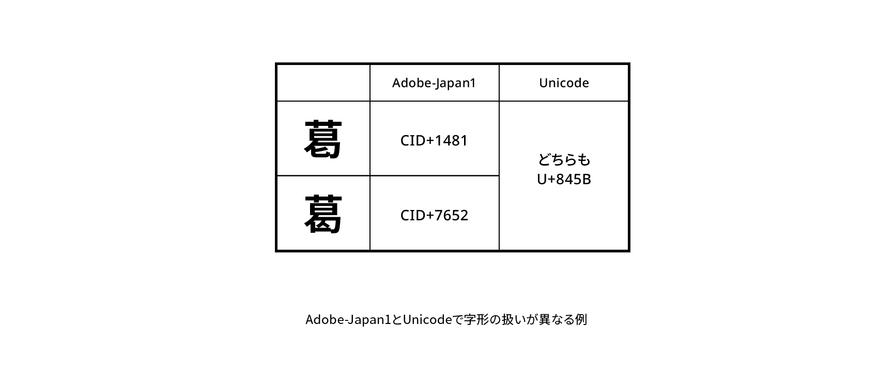

# Adobe-Japan1

Adobe-Japan1（アドビ・ジャパン・ワン）はアドビシステムズ社が定めている日本語のグリフの規格です。たとえば葛󠄀城市の「葛󠄀」と葛飾区の「葛」など、日本語には、Unicodeなどの文字コードだけでは補いきれない、細かな字形の違いを持つ漢字が数多くあります。Adobe-Japan1はこれらグリフを規格化し、日本語のフォントが収録するグリフを定めたものです。プロ用日本語フォントのほとんどがAdobe-Japan1に準拠しています。

Adobe-Japan1は1993年に発表されてから何度か拡張され、それぞれAdobe-Japan1-3のように追補番号をつけて呼ばれます。2019年時点の最新はAdobe-Japan1-7で、23,060のグリフが収録されています。

## 関連項目

- [字体](./jitai.md)
- [字形](./jikei.md)
- [異体字](./itaiji.md)
- [グリフ](./glyph.md)
- [文字コード](./character-encoding.md)
- [JIS2004](./jis2004.md)

## 参考資料

- ものかの「日本語オープンタイプフォーマットの基本」、『+DESIGNING VOLUME 44』マイナビ出版、2017
- [Adobe-Japan1規格 - フォント専門サイト fontnavi](https://fontnavi.jp/zakkuri/303-adobe-japan1.aspx)
- [Adobe-Japan1-7 文字コレクション](https://github.com/adobe-type-tools/Adobe-Japan1/blob/master/README-JP.md)
