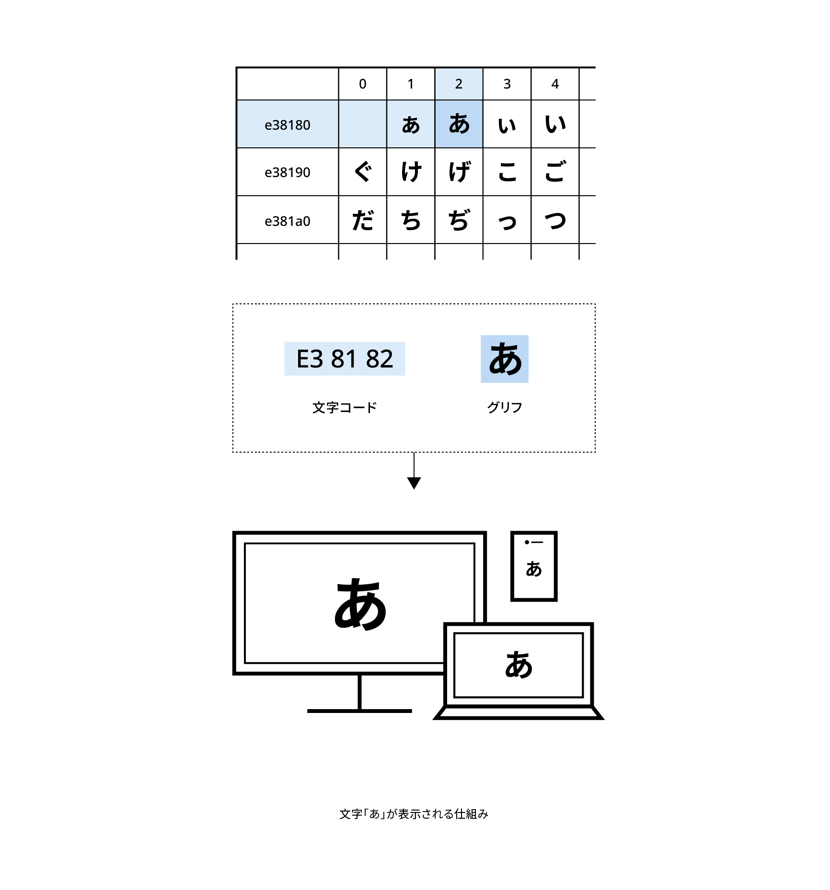

# 文字コード

文字コードはコンピューターで文字を扱うための仕組みです。文字ひとつひとつに対し、それぞれに対応する符号を定めた規則をいいます。「符号化文字集合」（coded character set）ともいいます。また、文字に対応する符号（例えば「`E3 81 82`」）自体も文字コードと呼ばれることがあります。

コンピューターのディスプレイに「あ」という文字が表示されるとき、私たちの目には「あ」の具体的な字形が見えています。しかしコンピューターの内部で認識されているのは「あ」という文字の「概念」を符号化した`E3 81 82`というような文字コードで、そこには字形のデータは含まれません。字形を持っているのはフォントのグリフです。文字コードとフォントのグリフが組み合わさってはじめてディスプレイに「あ」の文字が表示されるのです。



文字コードには国や地域によって様々な規格がありますが、WebではUTF-8が広く使われています。UTF-8は世界中の文字を扱えるUnicodeの符号化方式のひとつで、日本語はもちろん絵文字も自由に使えます。

## 実践

仕様ではHTML文書の文字コードはUTF-8でなければならないとされています。文書の文字コードを明示するには、以下のように`meta`要素の`charset`属性を使います。この指定は文書の先頭から1024バイト以内に書く必要があるため、`head`要素内の最初に配置するとよいでしょう。

```html
<head>
  <meta charset="utf-8">
  ...
</head>
```

文字化けなどの予期せぬトラブルを避けるためにも、HTML文書は必ずUTF-8で作成し、上記のようにコード中でも明示しましょう。

## 関連項目

- [字体](./jitai.md)
- [字形](./jikei.md)
- [グリフ](./glyph.md)
- [Unicode](./unicode.md)
- [UTF-8](./utf-8.md)

## 参考資料

- [head には何が入る? HTML のメタデータ - Web 開発を学ぶ | MDN](https://developer.mozilla.org/ja/docs/Learn/HTML/Introduction_to_HTML/The_head_metadata_in_HTML#Specifying_your_document's_character_encoding)
- [普通のHTMLの書き方](https://hail2u.net/documents/html-best-practices.html#use-utf-8)
- 矢野啓介『［改訂新版］プログラマのための文字コード技術入門』技術評論社、2019
- 『+DESIGNING VOLUME 42』マイナビ出版、2016
