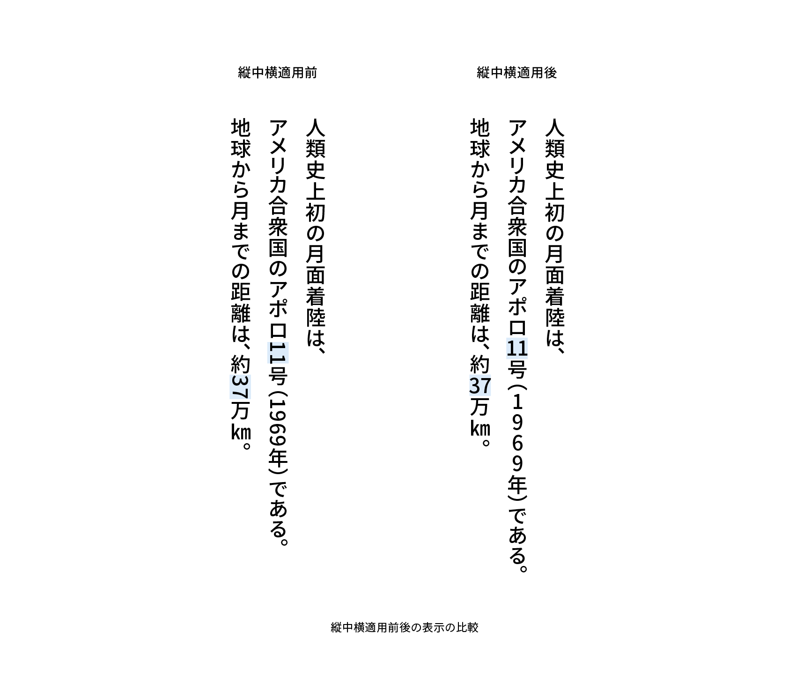

# 縦中横

縦中横（たてちゅうよこ、horizontal-in-vertical composition）は、縦組みの日本語テキストの中で横組みの欧文を水平に配置することをいいます。おもに3桁程度までの数字や単位を表す欧文などで使われます。



## 実践

CSSで縦中横を実現するには、該当箇所に`text-combine-upright: all;`を指定します。このとき横組みのテキストは1em分の幅に収まるよう縮小されます。なお`writing-mode`プロパティの値が`horizontal-tb`のとき（つまり横組みのとき）には無効です。

```html
<p>これは<span class="num">50</span>年代末に大流行した（<span class="num">108</span>ページ参照）。</p>
```

```css
p {
  writing-mode: vertical-rl;
}

p .num {
  text-combine-upright: all;
}
```

## 参考資料

- [ブラウザにおける縦書き - 縦書き実装の今 | CodeGrid](https://app.codegrid.net/entry/vertical-script-1)
- [CSS Writing Modeの仕様解説│縦書きWeb普及委員会](https://tategaki.github.io/explan1.html)
- [text-combine-upright - CSS: カスケーディングスタイルシート | MDN](https://developer.mozilla.org/ja/docs/Web/CSS/text-combine-upright)
