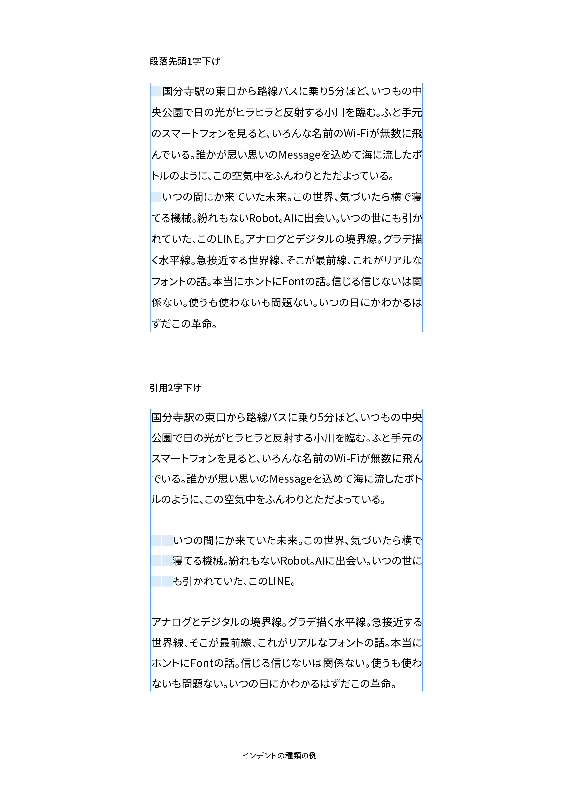

# インデント

インデント（indent）は、段落の先頭の行、もしくは段落全体の行の開始位置を本来の位置よりも下げることをいいます。字下げとも呼ばれます。連続する段落の境界を示すため各段落の1行目をインデントしたり、引用を示すために段落全体をインデントしたりといった使い方をします。

段落の境界を示すためにインデントを用いる場合、日本語では全角1字分とするのがもっとも一般的です。欧文では行間や行の長さなどに応じて決められるようです。ただしウェブにおいては、インデントではなく段落間の余白によって段落の境界を示すことが多いです。

また、段落全体をインデントし、先頭の行のみ開始位置を上げる場合もあります。これはアウトデントやぶら下げインデント（outdent、hanging indent、flush-and-hang）などと呼ばれます。



## 実践

段落の先頭行をインデントするには`text-indent`プロパティを利用します。マイナス値を指定するとアウトデントになります。段落全体をインデントする場合は`padding`や`margin`プロパティを利用します。

```css
p {
  margin-top: 0;
  margin-bottom: 0;
  text-indent: 1em;
}

ul {
  padding-left: 2em;
}

ul li {
  list-style-type: none;
  text-indent: -2em;
}

blockquote {
  padding-left: 2em;
}
```
