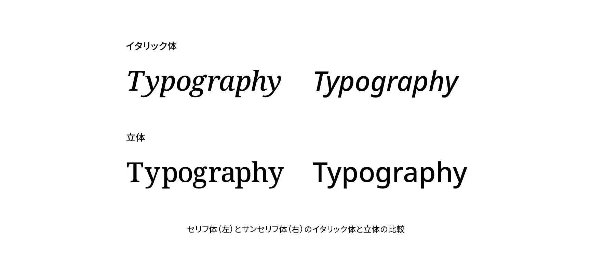
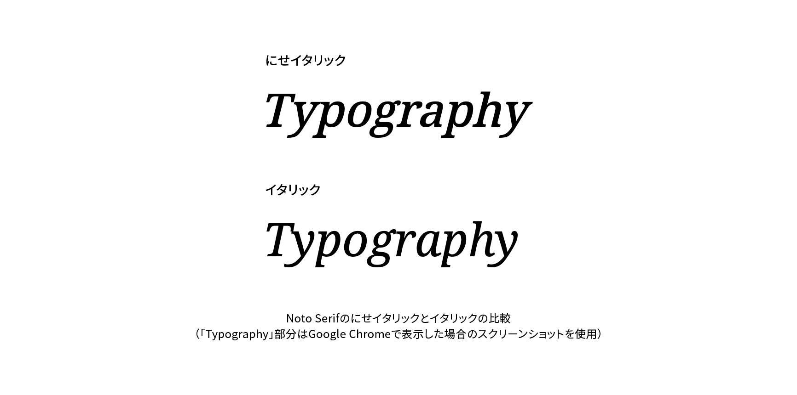

# イタリック体

イタリック体（italic）は、欧文書体のスタイルのひとつで、筆記体風の傾いた字形が特徴です。イタリック体ではないスタイルは立体やローマン体と呼ばれます。イタリック体は欧文固有のスタイルで、日本語のグリフはイタリック体を持ちません。



## 用法

欧文では、強調や、作品のタイトル、外国語などをイタリック体で表現することがあります。

## 実践

Webでイタリック体を利用する場合は、CSSで`font-family`プロパティの値に`italic`を指定します。

```css
.Quote {
  font-family: italic;
}
```

## 発展

イタリック体を利用しようと思っても、ファミリーがイタリック体を持っていなかったり、Webフォントでイタリック体がダウンロードされていなかったりすることがあります。そういった場合にCSSでイタリックを指定すると、ブラウザーは立体のフォントを機械的に傾けて擬似的なイタリック体として表示します。しかし本来イタリック体は立体をただ傾けたものではなく、異なる字形として独自にデザインされたものです。そのためブラウザーによる擬似的なイタリックは「にせイタリック（faux italic）」と呼ばれます。にせイタリックは本来の適切にデザインされた形ではないため、読みづらく、不格好なものになりがちです。イタリック体で表示するときは、ファミリーにイタリック体が含まれることを確認しましょう。



また、日本語書体にはイタリックに相当するスタイルはありません。CSSによって傾けることも可能ですが、欧文の「にせイタリック」同様、ブラウザーによる機械的な処理であり、書体デザイナーが意図したデザインではない点に注意が必要です。

## 関連項目

- [ローマン体](./roman.md)
- [ウェイト](./weight.md)
