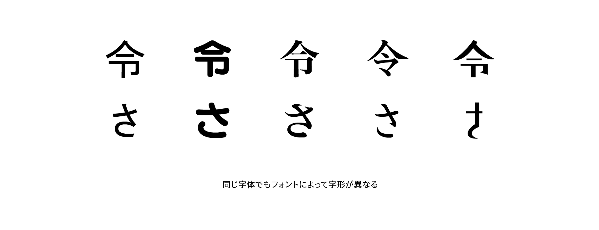

# 字体

字体は、文字の具体的な形ではなく、文字の抽象的な骨組みのことです。たとえば、同じ「あ」という文字でも明朝体とゴシック体で文字の形は異なります。しかし私たちはどちらも「あ」という文字として認識します。これは「あ」の字体という概念として私たちの頭の中にあるためです。

（*TODO* 図版：ある文字を思い浮かべる人のイラストなど、文字の骨格という抽象概念を表現するもの）

なお、印刷や画面表示などによって具体的に視覚化された文字の形を字形といいます。また、同じ読みと意味を持つ文字でも複数の字体を持つことがあり、これを異体字といいます。

## 関連項目

- [字形](./jikei.md)
- [異体字](./itaiji.md)
