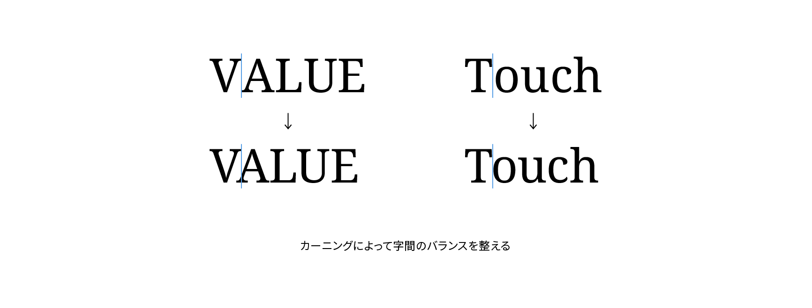

# カーニング

カーニング（kerning）は、特定の組み合わせの字間を広げたり狭めたりして調整することです。たとえば、Tとo、AとVといった組み合わせでは、ボディをそのまま並べると字間が不自然に空いて見える場合があります。これを解消するため、ボディを重ねて字間を詰めます。逆に字間が詰まりすぎて見える場合には、ボディの間を空けることもあります。



ただし、欧文の等幅フォントや、日本語の全角フォントは、字間を調整せずそのまま並べることを意図してデザインされているため、原則としてカーニングをおこないません。つまりカーニングは、プロポーショナル幅のボディを並べたときに字間を微調整することといえます。

なお、カーニングのように特定の組み合わせの字間を個別に調整するのではなく、ひとまとまりのテキストの字間を均等に調整することをトラッキングといいます。

## 実践

フォントには、どの文字の組み合わせの時に字間をどのように調整するかを決めたカーニング情報が含まれています。グラフィックデザインでは手動でカーニングをすることも多いですが、ウェブデザインではこの情報を使って自動的にカーニングをするのが基本です。

CSSにおけるカーニングは`font-kerning`プロパティで指定します。値は`auto`／`normal`／`none`が指定でき、初期値は`auto`です。`auto`が指定された場合、カーニングを有効にするかどうかはブラウザーに委ねられます。たとえば文字サイズが小さいとカーニングされないことがあります。カーニングを明示的に有効にしたい場合は`normal`を指定します。

`font-kerning`プロパティの初期値が`auto`であるため、フォントやブラウザーによっては、全角の日本語フォントでもカーニングが有効になってしまっていることがあります。これを避けるには全体に`none`を指定し、見出しなどプロポーショナル幅にしてカーニングを有効にしたい部分のみ`normal`にするとよいでしょう。

```css
html {
  font-kerning: none;
}

h1 {
  font-feature-settings: "palt";
  font-kerning: normal;
}
```

## 関連項目

- [ボディ](./body.md)
- [字間](./letter-space.md)
- [全角](./fullwidth.md)
- [等幅フォント](./monospaced-font.md)
- [プロポーショナルメトリクス](./proportional-metrics.md)
- [トラッキング](./tracking.md)

## 参考文献

- 小林章『欧文書体　その背景と使い方』美術出版社、2005
- サイラス・ハイスミス『欧文タイポグラフィの基本』グラフィック社、2014
- [【真夜中のOpenTypeフィーチャー講座】プロポーショナルメトリクスと自動カーニング - Togetter](https://togetter.com/li/1083953)
- [font-kerning - CSS: カスケーディングスタイルシート | MDN](https://developer.mozilla.org/ja/docs/Web/CSS/font-kerning)
